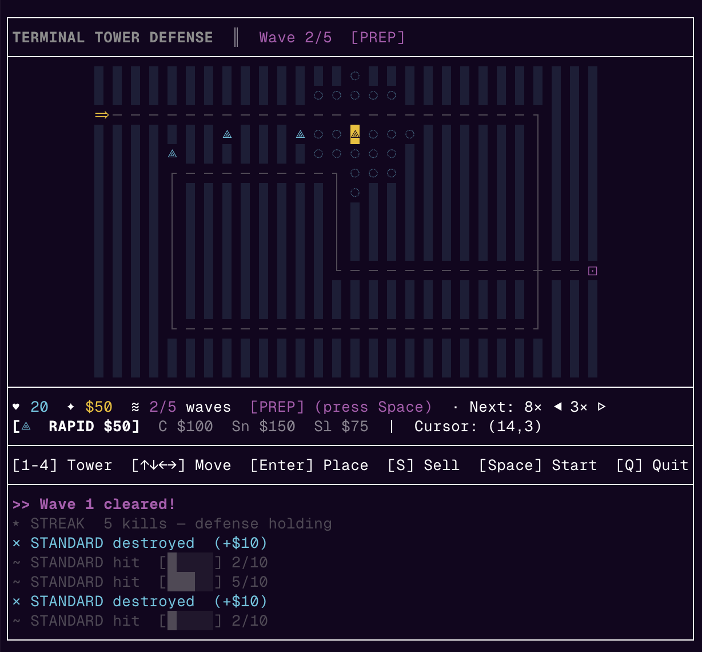
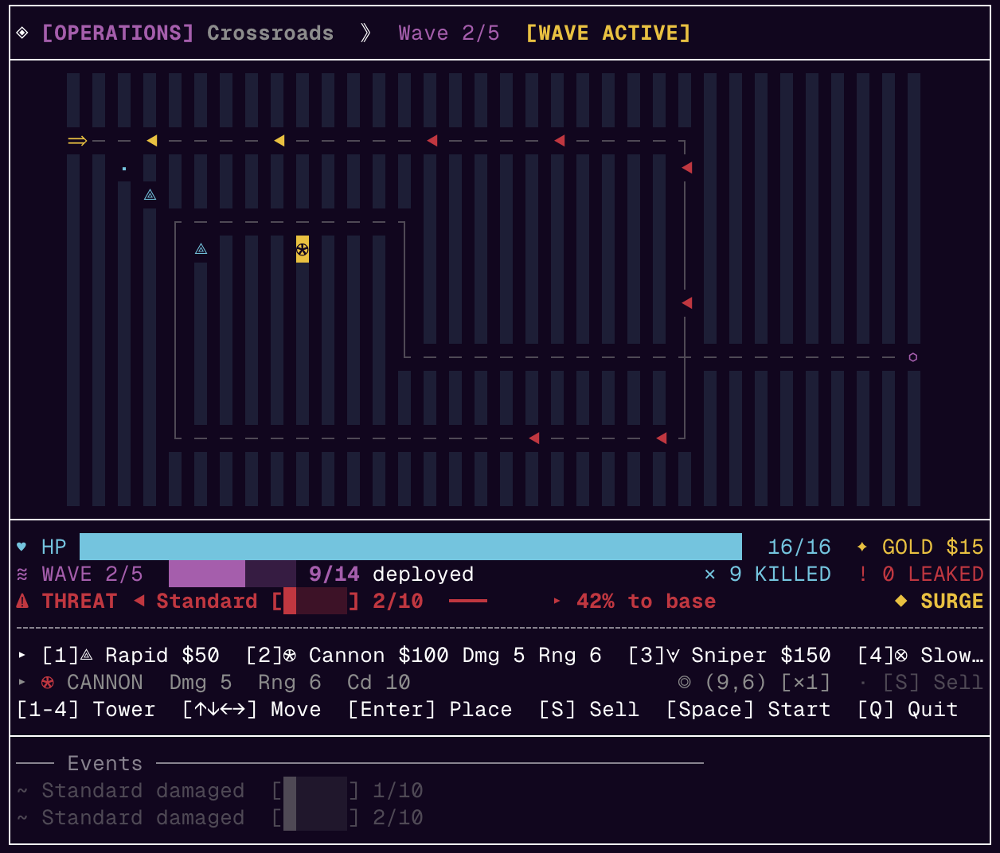

# Command Core

Terminal-native tower defense built with **Node.js + TypeScript + Ink**.

Command Core runs directly in your terminal (including tmux/SSH panes) and renders each frame as a single bordered text block.

## Screenshots

### Screenshot 1



### Screenshot 2



## Quick Start (Play Locally)

### 1) Clone the repo

```bash
git clone git@github.com:magimetal/command-core.git
cd command-core
```

If you prefer HTTPS:

```bash
git clone https://github.com/magimetal/command-core.git
cd command-core
```

### 2) Install dependencies

```bash
npm install
# (same as: npm i)
```

### 3) Start the game

```bash
npm start
```

### 4) Optional developer commands

```bash
npm run build
npm test
```

## What to Expect on Launch

1. **TITLE** screen (`COMMAND CORE`)
2. **MODE_SELECT** (`OPERATIONS` or `ANOMALY`)
3. **MAP_SELECT** (Operations only)
4. **PREP** phase (place towers)
5. **WAVE_ACTIVE** phase (combat)
6. **WAVE_CLEAR** between waves
7. **VICTORY** or **GAME_OVER**

Loop cadence is **67ms per tick** (~15 FPS target).

Deterministic tick pipeline (locked by tests):

1. `advanceWave`
2. `advanceEnemies`
3. `resolveCombat`
4. `cleanup`

## First 60 Seconds (Suggested New-Player Path)

If you just want to get into a run quickly, do this:

1. Launch with `npm start`.
2. On the title screen, press **any key**.
3. In **MODE_SELECT**, press `1` then `Enter` for **OPERATIONS**.
4. In **MAP_SELECT**, press `1` then `Enter` for **Crossroads**.
5. In **PREP**, press `1` for **Rapid** tower.
6. Move cursor onto a `░` build tile with arrow keys.
7. Press `Enter` to place your first tower.
8. Press `Space` to start Wave 1.
9. During the wave, watch:
   - threat line (`⚠ THREAT`) for closest danger
   - HP line for leaks (`!`) and survival status
10. When wave clears, place/sell in **WAVE_CLEAR**, then press `Space` to continue.

Quick safety keys:

- `Q` to quit immediately
- `R` to start a fresh run after win/loss

## Controls

### Global

- `Q` — quit immediately (takes precedence in all phases, including title)

### Title

- `Any key` — advance to mode select

### Menus (`MODE_SELECT`, `MAP_SELECT`)

- `↑ / ↓` — move selection
- `Enter` — confirm selection
- `1..4` — direct-select menu option index (when present)
- `Esc` or `B` — back (from map select to mode select)

### Gameplay (`PREP`, `WAVE_ACTIVE`, `WAVE_CLEAR`)

- `1..N` — select tower from currently available pool
- `↑ ↓ ← →` — move cursor
- `Enter` — place selected tower
- `S` — sell tower at cursor (**PREP** / **WAVE_CLEAR** only)
- `Space` — start wave (**PREP** only)

### End States

- `R` — start a new run from `GAME_OVER` / `VICTORY`

## Modes, Maps, and Starting Conditions

### OPERATIONS

- Hand-crafted maps with fixed waves
- Difficulty options:
  - `Crossroads` (Beginner)
  - `The Gauntlet` (Intermediate)
- Grid size: **16 rows × 34 columns**
- Starting state: **16 HP**, **$120**
- Tower pool: all 4 towers
- Score multiplier: **1.0x**

### Operations Waves (Crossroads)

1. `7× STANDARD`, `1× FAST`
2. `9× STANDARD`, `5× FAST`
3. `7× STANDARD`, `3× TANK`, `6× FAST`
4. `11× STANDARD`, `5× TANK`, `7× FAST`
5. `10× STANDARD`, `7× TANK`, `11× FAST`

### Operations Waves (The Gauntlet)

1. `8× STANDARD`, `2× FAST`
2. `10× STANDARD`, `6× FAST`
3. `8× STANDARD`, `4× TANK`, `7× FAST`
4. `13× STANDARD`, `6× TANK`, `8× FAST`
5. `11× STANDARD`, `8× TANK`, `12× FAST`

### ANOMALY

- Procedural map + randomized wave composition
- Grid size: **16 rows × 34 columns**
- Starting state: **24 HP**, **$165**
- Tower pool: randomized **3 of 4** towers per run
- Wave count: randomized **4 to 5** waves per run
- Score multiplier: **1.5x**
- Run identity: `Anomaly #<seed>`

Set a deterministic anomaly seed:

```bash
ANOMALY_SEED=12345 npm start
```

## Core Gameplay Rules

### Economy + Outcomes

- Gain currency from enemy kills.
- Spend currency on tower placement.
- Sell refund is `floor(cost / 2)`.
- **VICTORY** after clearing all waves.
- **GAME_OVER** when base HP reaches 0.

### Towers

| Archetype | Symbol | Projectile | Damage | Range | Cooldown (ticks) | Cost | Special |
|---|---|---|---:|---:|---:|---:|---|
| RAPID | `⟁` | `·` | 1 | 3 | 2 | 60 | Fast fire |
| CANNON | `⊛` | `●` | 5 | 6 | 10 | 100 | Heavy hit |
| SNIPER | `⟇` | `◦` | 8 | 8 | 15 | 150 | Long-range burst |
| SLOW | `⊗` | `~` | 2 | 4 | 6 | 75 | Applies slow (`slowDurationTicks=3`) |

### Enemies

| Archetype | Symbol | HP | Move cooldown* | Reward | Leak damage |
|---|---|---:|---:|---:|---:|
| STANDARD | `S` | 10 | 2 | 10 | 1 |
| TANK | `T` | 40 | 4 | 25 | 3 |
| FAST | `F` | 5 | 1 | 4 | 2 |

\*Lower move cooldown means faster movement cadence.

## HUD, Frame, and UX Notes

- Full bordered frame with section dividers.
- Grid is centered against wider HUD/log sections for tmux readability.
- Ceremony screens for `TITLE`, `MODE_SELECT`, `MAP_SELECT`, `VICTORY`, and `GAME_OVER`.
- Gameplay HUD uses a **fixed 6-line block**:
  - HP + gold line with wide HP bar
  - wave progress telemetry
  - threat radar / prep guidance / wave-clear guidance
  - divider
  - arsenal line
  - selected-tower + cursor detail line
- Placement aids:
  - ghost tower preview on valid buildable cursor cells in placement phases
  - range ring preview (`◌`) for selected tower in placement phases
- Cosmetic per-shot projectile glyphs.
- Event log behavior:
  - storage: **7 entries**, newest-first
  - gameplay display: **2 most recent entries**
  - semantic prefixes include `>>`, `✗`, `✕`, `!`, `~`

### Score Formula

Base score:

`max(0, enemiesKilled*12 + wavesCompleted*100 + currency - (startingHp - baseHp)*25)`

Final score:

`floor(baseScore * modeMultiplier)`

(`wavesCompleted` is total waves on victory, otherwise `wave - 1`.)

## Terminal Requirements and Troubleshooting

- Terminal-first experience (no browser renderer, no mouse input).
- Unicode + ANSI capable terminal recommended.
- Frame guardrails are validated in tests for terminal-safe output (up to 78 columns × 33 rows).
- If the pane is too narrow, the game renders a guidance frame instead of clipping gameplay.

### Accessibility / Hardening Flags

- `REDUCED_MOTION=1` disables frame-based pulse/scanline/blink motion.

Example:

```bash
REDUCED_MOTION=1 npm start
```

## Architecture

```text
src/
  const/        canonical gameplay constants (maps, towers, enemies, waves, timing)
  models/       state and domain types
  simulation/   pure deterministic game-state transforms
  rendering/    frame/HUD/menu/end-state composition and colorization
  input/        Ink key adapter
  app.tsx       loop timer + action wiring + phase transitions
  main.ts       CLI entrypoint

tests/
  simulation/   movement, combat, economy, placement/sell, waves, end-states, score
  rendering/    frame layout, HUD/menu/title/end-state behavior, terminal guardrails
  input/        control routing and title/menu precedence behavior
```

## Project Docs

- `SPEC.md` — product and MVP contract
- `MVP.md` — implementation process/decision history
- `CHANGELOG.md` — milestone and unreleased change history
